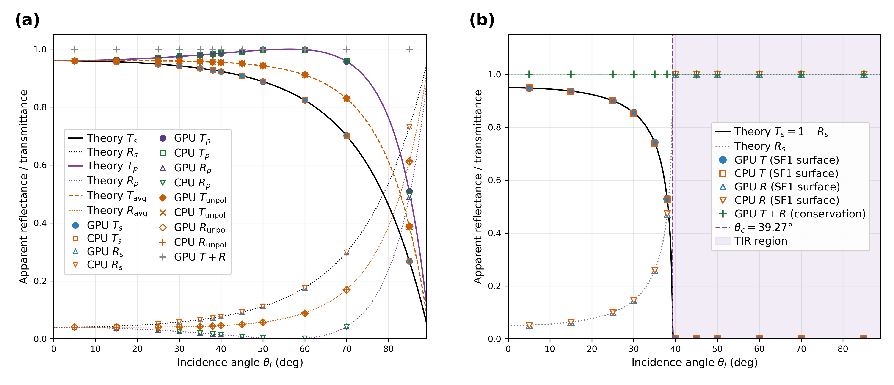

# 02_reflection_refraction_tir

Scans Fresnel reflection/refraction (U1) and total internal reflection TIR (U2) at a vertical planar interface across 12 incidence angles, comparing GPU (Metal) vs Geant4 CPU vs analytic Fresnel. Benchmark 02 = paper **B1**, and produces **Figure 2**.



## Setup

Three polarizations (U1 s-pol / p-pol / unpol) at the Air→Glass interface plus U2 BC408→Air TIR, 4 tests total, are run over the same 12 angles (`5 15 25 30 35 38 40 45 50 60 70 85` deg).

| Test (runner) | Interface | Polarization (BeamPolarization) | Measurement |
|---|---|---|---|
| U1 s-pol (`build_run_u1v5.py`) | Air→Glass (n=1.5), x=0 vertical interface | ⟂ (X=0,Y=1,Z=0) | reflection R / transmission T |
| U1 p-pol (`build_run_u1v5_ppol.py`) | same interface | ∥ (X=1,Y=0,Z=0) | R/T (including **Brewster angle**) |
| U1 unpol (`build_run_u1v5_unpol.py`) | same interface | TOPAS default random pol | R/T (s/p average) |
| U2 TIR (`build_run_u2v5.py`) | BC408 (n=1.58)→Air, x=0 vertical interface | ⟂ (X=0,Y=1,Z=0) | transmission T (R = 1−T) |

### Geometry / material

The Python runner generates the per-angle config inline (no separate `configs/` directory). Dimensions are half-length (HL).

| Volume | Type | Material | Position/dimensions | Role |
|---|---|---|---|---|
| **U1** World | — | Air | 150 mm cube (HL 75) | world |
| Glass | TsBox | GlassN15Abs (n=1.5, AbsLen 1 cm) | HLX 37 / HLY,HLZ 70, TransX +37 | +x half glass, x=0 interface |
| AirRefl | TsBox | Air | HLX 0.5 / HLY,HLZ 70, TransX −1 | thin Air slab left of interface (catches reflected light) |
| **U2** World | — | Air | 260×150×150 mm (HLX 130) | world extended in x |
| Sci | TsBox | Buapfcfm (n=1.58, AbsLen 100000 cm) | 120 mm cube (HL 60), TransX −60 | BC408, +x face is the x=0 interface |
| Wrap_{Xm,Yp,Ym,Zp,Zm} | TsBox | BuapfcfmBlack (n=1.58, AbsLen 1 mm) | 0.5 mm thick, 5 faces | wraps 5 faces with same-n absorber, leaving only single-bounce |
| AirDet | TsBox | Air | HLX 0.5 / HLY,HLZ 60, TransX +1 | thin Air slab on +x side (catches transmitted light) |

- **U1** (Air→Glass): T = light entering Glass (refracted transmission), R = reflected light returning to the Air slab on the left of the interface.
- **U2** (BC408→Air): the source is inside BC408. T = light entering AirDet (refracted transmission). Above the critical angle (≈39.27°), photons are trapped inside BC408 and absorbed → T=0, and R=1−T by conservation.

### Source / Beam

- `opticalphoton` Beam, 2.5 eV, monochromatic, `NumberOfHistoriesInRun = 100000`.
- The source sits on a radius-50 circle around (0,0,0): position `(−50 cos θ, 0, +50 sin θ)`, beam direction `(cos θ, 0, −sin θ)` aimed at the origin (RotY = −(90+θ)). For U2 the same circle lies inside BC408.
- Beam width / angular spread ~0 (point-parallel beam). The GPU uses the TOPAS-Beam source as-is (not the BEAM kernel).

### Scorer

| Mode | Quantity | Measurement face (going `in`) |
|---|---|---|
| GPU | `GPUOpticalPhotonSurfaceTrackCount` | T: `Glass/XMinusSurface` · R: `AirRefl/XPlusSurface` · U2 T: `AirDet/XMinusSurface` |
| CPU | `SurfaceTrackCount` (`OnlyIncludeParticlesNamed = opticalphoton`) | same |

The surface track count (SF1) counts the number of photons at the R (reflection face) and T (transmission face). Not parallel-world. For the U1 R face (`AirRefl/XPlusSurface`), the incident beam passing through in the +x direction is excluded as going_out, and only the reflected light returning in the −x direction is counted as going_in.

## Running

| Script | Output | Method |
|---|---|---|
| `run_cpu.sh` | `results/built/U*_cpu_th*_{R,T}_sf1.csv` | CPU (Geant4 g4optical), 4 tests × 12 angles |
| `run_gpu.sh` | `results/built/U*_gpu_th*_{R,T}_sf1.csv` | GPU (TOPAS-Beam + gpuoptical), same |
| `scripts/fig_02_angle_scan.py` | `results/fig_02_angle_scan.{png,pdf}` | generates the figure after both gpu+cpu have run |

Both runners call the 4 Python runners (`build_run_u1v5{,_ppol,_unpol}.py`, `build_run_u2v5.py`) sequentially to generate the config inline and run it (cpu/gpu selected via the `MODE` env).

```bash
cd benchmark/02_reflection_refraction_tir
./run_cpu.sh                              # CPU reference (4 tests × 12 angles)
./run_gpu.sh                              # GPU (TOPAS-Beam)
python3 scripts/fig_02_angle_scan.py      # → results/fig_02_angle_scan.{png,pdf}

# partial angles: ./run_gpu.sh "30 45"   or   ANGLES="30 45" ./run_cpu.sh
```

### Environment variables

| Variable | Default | Scope | Description |
|---|---|---|---|
| `TOPAS` | `…/topas-gpu` | GPU/CPU | TOPAS binary (**patched required**; unpatched gives fluence 4× over) |
| `ANGLES` | `5 15 25 30 35 38 40 45 50 60 70 85` (deg) | GPU/CPU | first argument or env. space/comma separated |
| `THREADS` | `1` | GPU/CPU | when set, the runner injects `i:Ts/NumberOfThreads` |
| `MODE` | set by runner (`gpu`/`cpu`) | Python runner | to run both, call directly with `MODE="gpu cpu"` |

## Notes

- Every run automatically uses `G4TRACE_DIR=OFF` — this turns off g4trace disk logging. Without it, CPU is tens to hundreds of times slower (physics results are bit-identical).
- GPU `Ts/Seed = 42` is fixed → bit-reproducible.
- The shared shell (`common/unit_test_shell.txt → bc408.txt`) uses the `../../common/` relative path, but TOPAS resolves includes relative to the run cwd (`results/built`, 3-level). The runner creates a `common → ../common` symlink (`ln -sfn`) to correct for the 2-level structure.
- Above the U2 critical angle (θ≳39°), R is not measured directly but obtained as `R = 1 − T` (conservation) — trapped photons vanish into the same-n absorbing wrap, so the reflection-face counter is meaningless.

## File structure

```
02_reflection_refraction_tir/
├── run_cpu.sh                          # CPU(Geant4) angle-scan runner
├── run_gpu.sh                          # GPU(TOPAS-Beam) angle-scan runner
├── common -> ../common                 # shared includeFile symlink
├── scripts/
│   ├── build_run_u1v5.py               # U1 s-pol  (Air→Glass, Pol Y=1)
│   ├── build_run_u1v5_ppol.py          # U1 p-pol  (Pol X=1, Brewster)
│   ├── build_run_u1v5_unpol.py         # U1 unpol  (TOPAS default random pol)
│   ├── build_run_u2v5.py               # U2 TIR    (BC408→Air, source inside)
│   └── fig_02_angle_scan.py            # Figure 2 (U1 air/glass + U2 TIR 2-panel)
└── results/
    ├── built/                          # inline-generated config + CSV (regenerated)
    │   ├── U1v5_{cpu,gpu}_th{θ}.txt                generated config
    │   ├── U1v5{,_ppol,_unpol}_{cpu,gpu}_th{θ}_{R,T}_sf1.csv
    │   └── U2v5_{cpu,gpu}_th{θ}_T_sf1.csv          U2 has T only (R=1−T)
    └── fig_02_angle_scan.{png,pdf}     # final figure
```

- `../common/unit_test_shell.txt`, `../common/bc408.txt` — common includeFile (minimal world / Air optical properties, BC408-equivalent plastic scintillator definition). `../common/topas_env.sh` sets the `TOPAS` default.
- The configs (`*.txt`) and CSVs in `results/built/` are regenerated by the runner.

Master index: [`../README.md`](../README.md)
