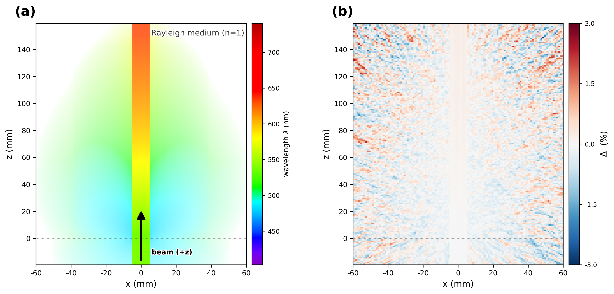

# 03_rayleigh

Rayleigh colour-separation demo — "blue sky / red sunset" (benchmark 03 = paper B2, Figure 3).
A white continuous beam passes through a **non-refracting (n=1)** Rayleigh box along +z, and we
compare GPU (Metal) vs Geant4 CPU as the colours separate purely from wavelength-selective Rayleigh
scattering (∝ λ⁴). Short wavelengths (blue) scatter strongly into a side halo (blue sky), while long
wavelengths (red) transmit so the forward beam reddens with depth (red sunset). Because n=1 the beam
does not bend, so the colour separation comes from **pure scattering** — it shows the same colour
phenomenon as refraction (prism, benchmark 08) but via a different mechanism.



## Setup

### Geometry

All `TsBox`, centred at the world origin ("world z" = beam propagation axis).

| Volume | Parent | half-size HLX×HLY×HLZ (mm) | Centre (mm) | z range (mm) | Material |
|---|---|---|---|---|---|
| `World` | — | 100 × 100 × **170** | (0,0,0) | −170 … +170 | Air |
| `Medium` (Rayleigh box) | World | 40 × 40 × **75** | (0,0,**75**) | **0 … 150** | `RayColor` |
| `ScoreBox` (parallel) | World | 60 × 2 × **90** | (0,0,**70**) | −20 … 160 | (scoring only) |
| `BeamPos` (group) | World | — | (0,0,**−30**) | — | — |

- The Rayleigh medium spans **z = 0 – 150 mm** (80 × 80 × 150 mm). Everything outside (z<0, z>150,
  the sides) is **Air** (not vacuum) — n=1, non-absorbing (`AbsLength` 1e6 cm), non-scattering (no
  RAYLEIGH), so optically it behaves like vacuum: straight, lossless. The beam starts at z=−30 in air
  and enters the box at z=0.
- World HLZ is 170 (not 150) — so the ScoreBox (out to z=160) does not extend beyond the world (a
  too-small world triggers a Geant4 geometry-overlap abort).

### Materials (optical properties)

| | Air (world) | RayColor (box) |
|---|---|---|
| Refractive index | 1.0 (flat) | **1.0 (flat)** — no refraction |
| Absorption length | 1e6 cm (none) | 1e6 cm (none) |
| Rayleigh length | — (no scattering) | **L(E) = 25·(3.10/E)⁴ mm** (∝ λ⁴) |

The Rayleigh length is tabulated at **31 points** over 1.65–3.10 eV (blue end 25 mm → red end 311 mm).
For the interpolation caveat see [## Notes](#notes).

### Source / Beam

- `opticalphoton`, **continuous spectrum** (energy-flat) **1.65 – 3.10 eV** (≈ 400 – 751 nm, full visible),
  emitted from world **(0, 0, −30) mm** (in air, 30 mm ahead of the box entrance face) head-on in the **+z**
  direction (no angular spread, parallel beam).
- The cross section is a flat disc, Ellipse cutoff at **radius 5 mm** (diameter 10 mm). **Unpolarized**
  (random transverse) — identical for both engines.
- Default photon count **1 000 000 000** (10⁹ = paper B2 statistics); for a quick demo use `HIST=5000000` (5 M).
- The GPU uses the **BEAM kernel** (kernel-side photon generation; TOPAS `So/Beam` fires only 1 trigger
  event), while the CPU uses the TOPAS `So/Beam` source.

### Scorer

Energy-resolved x–z fluence (`Sc/XZE`).

| Axis | Bins | Range |
|---|---|---|
| X | 120 | ±60 mm (1 mm) |
| Y | 1 | ±2 mm (integrated) |
| Z | 180 | scorer-local ±90 mm → world z −20 … 160 (1 mm) |
| Energy | 30 | 1.65 – 3.10 eV |

- Registered as a parallel world (`IsParallel`; the GPU config additionally registers it in `Ph/Optical/LayeredMassGeometryWorlds`), filtered to `opticalphoton`
  only. GPU = `GPUOpticalPhotonFluence`, CPU = `Fluence` (same binning).
- CSV layout (identical for both engines, `TsScoreGPUOpticalPhotonFluence.cc`): one row = one (iX,iZ) voxel,
  in **iZ-outer, iX-inner** order (iX = row%120, iZ = row//120); columns = `underflow(=0), E-bin[0..29],
  overflow(=0), no-track(=0)`. **There is no explicit spatial-index column** — position is determined by
  row order. Energy bin centre e: 1.65 + (e+0.5)·(1.45/30) eV.

## Running

```bash
cd benchmark/03_rayleigh
./rayleigh_color_run.sh                 # → results/rayleigh_color_{GPU,CPU}.csv  (gpu+cpu)
./rayleigh_color_run.sh gpu             # GPU only
python3 plot_color.py                   # → results/fig_03_rayleigh_color.{png,pdf}
```

| Script | Output | How |
|---|---|---|
| `rayleigh_color_run.sh` | `results/rayleigh_color_{GPU,CPU}.csv`, `results/run_{gpu,cpu}.log` | Runs the committed `configs/rayleigh_color_{gpu,cpu}.txt`, GPU (BEAM kernel) then CPU |
| `plot_color.py` | `results/fig_03_rayleigh_color.{png,pdf}` | spectral → colour render, GPU·CPU colour maps + relative difference. Prints forward·side mean energy/wavelength and Δ to the console |

The `fig_03_rayleigh_color.png` (1×2) that `plot_color.py` draws: **(a)** GPU x–z fluence colour map —
each voxel is coloured by that voxel's fluence-weighted mean wavelength (shared wavelength colourbar),
empty space white, with a +z arrow. **(b)** GPU vs CPU relative difference 100·(GPU−CPU)/CPU [%], fixed
±3 % diverging scale, unmasked (scattered light fills the whole cube). The speckle is zero-centred Poisson
noise; the faint warm tint along the axis is a deep-axis residual.

### Environment variables

| Variable | Default | Scope | Description |
|---|---|---|---|
| `HIST` | `1000000000` | `rayleigh_color_run.sh` | photon count (10⁹ = paper B2; quick demo `HIST=5000000`). GPU→`u:Ph/Default/GPUOptical/BeamPhotons`, CPU→`i:So/Beam/NumberOfHistoriesInRun` |
| `ENGINES` | `gpu cpu` | `rayleigh_color_run.sh` | 1st argument or env. `gpu` or `cpu` alone is also allowed |
| `THREADS_CPU` | `20` | `rayleigh_color_run.sh` | CPU thread count (irrelevant for GPU, which uses 1 trigger) |
| `TOPAS` | `topas-gpu` (`../common/topas_env.sh`) | `rayleigh_color_run.sh` | TOPAS binary (**patched required**; unpatched over-counts fluence 4×) |

- The GPU uses 1 trigger event, so it runs on thread 1 and is **deterministic**. The CPU uses thread=20
  (set by the script).
- **`G4TRACE_DIR=OFF`** is applied automatically (g4trace disk logging off → normal speed, bit-identical
  results).
- Regenerate the data CSV with the script above. To re-run GPU only (or a different N), run
  `HIST=… ./rayleigh_color_run.sh gpu` then re-run `plot_color.py`.

## Notes

- **Unpolarized is mandatory**: a fixed linear polarization shifts the in-plane halo by up to ~40 %
  (Rayleigh is polarization-dependent) → GPU/CPU must use the exact same unpolarized (random transverse)
  beam for the colour separation to match.
- **linear vs spline interpolation drift**: a sparse 5-point RAYLEIGH table is not enough — the GPU
  interpolates the property LUT **linearly**, while the CPU (Geant4/`TsMaterialManager`) uses **spline**
  interpolation → the two diverge between knots on the steep convex λ⁴ curve (linear overestimates the
  length → GPU scatters blue less → the forward mean wavelength accumulates ~2 nm bluer by z=120 mm;
  transmission is exponential, so it accumulates with depth). Refining to **31 points** makes linear ≈
  spline and cuts the drift ~10× (≤0.25 nm) — which is why the config uses 31 points.
- **dual-estimator caveat**: the GPU `GPUOpticalPhotonFluence` and the CPU `Fluence` are different
  estimators, so the residual cannot be conclusively attributed to either transport or the scorer.
- **GPU BEAM kernel**: kernel-side photon generation is ~560× faster than the TOPAS-Beam genstep path
  with identical physics (kernel/CPU sub-1%).

## File structure

```
03_rayleigh/
├── rayleigh_color_run.sh               # runner (GPU BEAM kernel + CPU; runs configs/*.txt)
├── plot_color.py                       # colour-separation demo figure (spectral → colour render, GPU·CPU + relative diff)
├── configs/
│   ├── rayleigh_color_gpu.txt          # GPU BEAM kernel config (committed TOPAS config)
│   └── rayleigh_color_cpu.txt          # CPU (Geant4 g4optical) config
└── results/
    ├── rayleigh_color_{GPU,CPU}.csv    # energy-resolved x-z fluence (regenerated by the script)
    ├── run_{gpu,cpu}.log               # TOPAS run log (regenerated by the script)
    └── fig_03_rayleigh_color.{png,pdf} # final figure (1×2: colour map + GPU/CPU relative diff)
```

Master index: [`../README.md`](../README.md)
