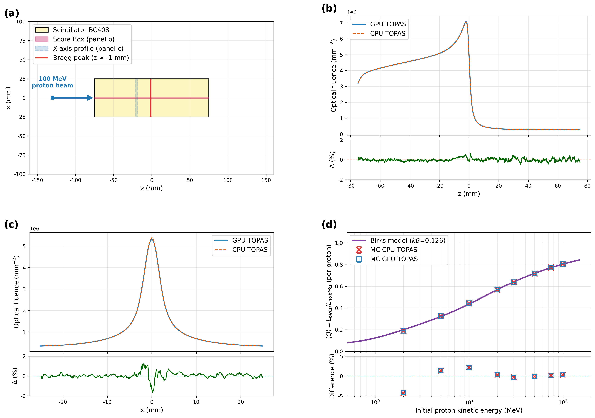

# 04_birks

A proton beam is stopped near the Bragg peak in a BC408 scintillator, and the light-yield reduction
due to **Birks quenching** (light-yield quenching) is compared between the **GPU (Metal) optical engine vs Geant4 CPU**
and contrasted against Birks theory (kB=0.126 mm/MeV).



`fig_04_birks.png` (2×2): (a) setup geometry (XZ slice), (b) dL/dz beam-axis optical fluence z-profile + ratio,
(c) lateral profile (z=−20 mm plateau slab, x) + ratio, (d) Birks Q(T) energy scan (proton 2~100 MeV, MC points vs kB=0.126 theory curve).

## Setup

### Geometry

| Volume | Type | Size (half-length) | Material | Notes |
|---|---|---|---|---|
| `World` | — | HLZ=20 cm | Air | `common/unit_test_shell.txt` include |
| `Sci` | TsBox | 25×25×75 mm (50×50×150 mm, z∈[−75,+75]) | `Buapfcfm` (BC408) | proton-stopping medium, kB=0.126 |
| `ScoreBox` | TsBox | 25×25×75 mm (same as Sci, auto-shrink) | — | full-cube fluence scorer, IsParallel |
| `ScoreBox_Z` | TsBox | 1×1×75 mm (beam-axis tube) | — | dL/dz (panel b), IsParallel |
| `ScoreBox_X` | TsBox | 25×1×1 mm (z=−20 mm slab) | — | lateral profile (panel c), IsParallel |

The range of a 100 MeV proton in BC408 is ≈ 80 mm, so it stops completely inside the 150 mm cube.
The parallel-world scorer is set to the same size as the mass-world `Sci`, and the auto-shrink patch handles the PW coincident-boundary.

### Source/Beam

| Item | Value |
|---|---|
| Particle | proton |
| Energy | 100 MeV (panel d scan: 2~100 MeV), `BeamEnergySpread = 0` |
| Photons / run | 2500 (`NumberOfHistoriesInRun`, main full-cube configs + panel-d scan); the GPU z/x profile configs use 20000 |
| Position distribution | Gaussian, Ellipse cutoff, SpreadX/Y=1 mm, CutoffX/Y=5 mm |
| Incident direction | +z, `BeamAngularDistribution = None` |
| Generation position | `BeamPos` group, TransZ=−100 mm → Sci entry face z=−75 mm |
| Photon generation | proton → BC408 scintillation (TOPAS-Beam primary, GPU side tracks scintillation photons) |

### Scorer

| | GPU (`gpuoptical`) | CPU (`g4optical`) |
|---|---|---|
| Quantity | `GPUOpticalPhotonFluence` | `Fluence` |
| full-cube | `U5short_Fluence` 100×50×300 voxel | `U5short_Fluence` 100×50×300 |
| z-tube (panel b) | `_Z` scorer in separate config `*_z`, 1×1×1500 | `U5short_Fluence_Z` 1×1×1500 |
| x-slab (panel c) | `_X` scorer in separate config `*_x`, 500×1×1 | `U5short_Fluence_X` 500×1×1 |
| edep (proton dE/dz) | `U5short_Edep` (mass-world `Sci`) 1×1×200 | `U5short_Edep` 1×1×200 |

- **GPU** follows the single-scorer rule, outputting only one scorer per run → fluence/z/x each come from a separate config (`gpu`, `gpu_z`, `gpu_x` + Birks-off pair). The full-cube CSV is used only for the whole-volume on/off sums (Birks Q); the z/x profiles come from the dedicated single-scorer configs.
- **CPU** allows multi-scorer, so a single `U5_short_cpu.txt` config contains all 4 scorers fluence+z+x+edep.

## Running

| Script | Output (results/) | Panel | Method |
|---|---|---|---|
| `run_profile.sh` | `U5short_{GPU,CPU}_*.csv` (fluence/z/x/edep, on·off) + console Birks Q | (a)(b)(c) | runs GPU 5 + CPU 2 configs automatically |
| `run_scan_seeds.sh` | `U5seed_{GPU_,}T{T}_{on,off}_s{s}_fluence.csv` | (d) | energy×seed scan (multi-seed) |
| `plot.py` | `results/fig_04_birks.{png,pdf}` | all | all CSVs → 4-panel figure |

```bash
cd benchmark/04_birks
./run_profile.sh                 # main panels (GPU 5 + CPU 2 configs) + console Birks Q
ENG=gpu ./run_scan_seeds.sh      # panel (d) GPU scan
ENG=cpu ./run_scan_seeds.sh      # panel (d) CPU scan (if omitted, only the CPU markers in panel d are missing)
python3 plot.py                  # → results/fig_04_birks.png
```

The data CSVs (`results/U5*.csv`) are **gitignore**d, so regenerate them with the above. GPU takes a few to tens of seconds per run; CPU directly tracks
scintillation photons, so it is slow (the CPU main of `run_profile.sh` is multi-scorer, ~20 min/run, and the full `run_scan_seeds.sh` CPU run takes even longer).

### Environment variables

| Variable | Default | Scope | Description |
|---|---|---|---|
| `ENG` | `gpu` | `run_scan_seeds.sh` | engine selection (`gpu`\|`cpu`) |
| `ENERGIES` | `2 5 10 20 30 50 75 100` | scan scripts | proton energies (matches plot.py `scan_T`) |
| `SEEDS` | `1 2 3 4 5` | `run_scan_seeds.sh` | seed list (panel d averages n=5) |
| `PHOTONS` | `2500` | scan scripts | histories per run |
| `TOPAS` | `common/topas_env.sh` | all | TOPAS binary override |

- To run only a subset: `ENERGIES="100" ENG=gpu ./run_scan_seeds.sh`.

## Notes

- **Console Birks Q reference**: the Birks Q in the `run_profile.sh` console is based on the **whole scintillator scorer** (`U5short_*_fluence`, on/off). It is not the thin 1×1 mm z-tube (`*_fluence_z`) — Birks changes the spatial distribution of the light, which introduces a geometric bias in the tube ratio.
- **panel d data path**: plot.py panel (d) reads only the seed-averaged (n=5) `U5seed_…` CSVs produced by `run_scan_seeds.sh`. It uses `BeamEnergy=T` + `BirksConstant=0.126`(on)/`0`(off) to obtain the 1×1×1 integrated fluence, and during the scan the main z/x CSVs are protected with temporary names.
- **Missing-file handling**: plot.py handles missing **scan** CSVs gracefully (omits the panel d markers), but the **main panel CSVs (z/x/full/edep) are required** (crash if absent). It also prints the proton range·straggling to the console.
- **G4TRACE_DIR=OFF**: every run script sets `export G4TRACE_DIR=OFF` to disable g4trace disk logging (if not disabled, CPU is tens to hundreds of times slower; results are bit-identical).

## File structure

```
04_birks/
├── run_profile.sh             # main panels (GPU 5 + CPU 2 configs) + console Birks Q
├── run_scan_seeds.sh          # panel (d) energy×seed scan (ENG=gpu|cpu) — the path plot.py reads
├── plot.py                    # generates the 4-panel figure
├── configs/
│   ├── U5_short_{gpu,cpu}.txt                  # main (Birks on)
│   ├── U5_short_{gpu,cpu}_birksoff.txt         # main (Birks off)
│   └── U5_short_gpu_{z,z_birksoff,x}.txt       # GPU-only z/x scorers (single-scorer rule)
└── results/                   # *.csv (gitignore, regenerated) + fig_04_birks.{png,pdf}
    ├── U5short_{GPU,CPU}_{fluence,fluence_z,fluence_x,edep}[_birksoff].csv  # main panels
    ├── U5seed_{GPU_,}T{T}_{on,off}_s{s}_fluence.csv                         # panel d
    └── fig_04_birks.{png,pdf}
```

Master index: [`../README.md`](../README.md)
