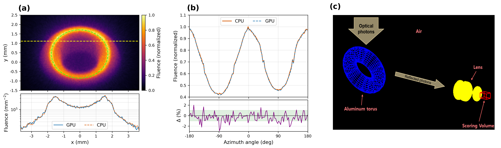

# 05_torus

In the production imaging setup of a torus-shaped **diffuse Al mirror** + BK7 lens + camera sensor,
the sensor fluence of an opticalphoton beam is compared between **GPU (Metal)** and **Geant4 CPU** (paper Fig 5 = 10B).
The mirror is a curved surface formed by applying a `dielectric_metal` + `ground` finish (UNIFIED diffuse) to `G4Torus` (`G4_Al`),
and the beam is generated on the GPU by the BEAM kernel (kernel-side generation) and on the CPU by the TOPAS-Beam source.



## Setup

### Geometry

| Volume | Type | Dimensions | Material | Note |
|---|---|---|---|---|
| World | TsBox | HLX/HLY/HLZ = 20/15/40 cm | Air | |
| MirrorTorus | G4Torus | RMin 0, RMax 8 mm, RTor 20 mm, DPhi 360°, RotX −45° | G4_Al | diffuse mirror |
| MySTL | TsCAD (stl) | `simple_biconvex_lens_new.stl`, RotY 180°, TransZ = −`stlTotalTrans` | BK7 | biconvex lens |
| ImagingSensor | TsBox | HLX/HLY/HLZ = 3.672/2.808/0.1 mm, TransZ = `imgTransZ − imgShiftToZ` (imgShiftToZ 10.4 mm) | Air | thin focal-plane |

### Material / Surface

- **BK7 lens**: RIndex 1.513–1.531 (1.77–3.10 eV), AbsLength 50 cm. Lens surface
  `MySurfaceName` = `dielectric_dielectric` / UNIFIED / Polished.
- **MirrorSurface** (torus): `dielectric_metal` / UNIFIED / **ground** (micro-facet diffuse).
  Reflectivity 0.95, SpecularSpike 0.05 (lobe/backscatter 0) → almost Lambertian diffuse.
- The shared optical materials are included from `../common/OpticalMaterialSample.txt`.

### Source / Beam

| Item | Value |
|---|---|
| Particle | opticalphoton, 2.5 eV |
| Position | BeamPos (0, 49, 0) mm, RotX −90° → beam travel direction world −Y |
| Position cross-section | Flat rectangle, half-width 25 × 25 mm |
| Angular distribution | Gaussian σ 0.3 rad, cutoff 0.393 rad (= 45° cone) |
| Photon count | 10B (paper Fig 5) |
| GPU generation | BEAM kernel — `u:Ph/Default/GPUOptical/BeamPhotons = 1.0e10`, single trigger event |
| CPU generation | TOPAS-Beam source — `i:So/Light/NumberOfHistoriesInRun = 1e9` × seed 1–10 |

### Scorer

| Item | GPU | CPU |
|---|---|---|
| Quantity | `GPUOpticalPhotonFluence` | `Fluence` |
| Component | ImagingSensor | ImagingSensor |
| Binning | 816 × 624 × 1 (thin focal-plane) | 816 × 624 × 1 |
| Particle filter | opticalphoton only | opticalphoton only |
| Output | `torus_diffuse_10B_beamgpu_GPU.csv` | `torus_diffuse_10B_CPU_fresh.csv` |

## Running

| Script | Output | Method |
|---|---|---|
| `run_gpu.sh` | `results/torus_diffuse_10B_beamgpu_GPU.csv` | GPU 10B single shot (BEAM kernel, single trigger event) |
| `run_cpu.sh` | `results/torus_diffuse_10B_CPU_fresh.csv` (+ per-seed `*_s$s.csv`) | CPU 1e9 × seed 1–10 → element-wise sum |
| `plot.py` | `results/fig_05_torus.{png,pdf}` | two CSVs → 2×3 (GPU map+lineout / azimuthal profile+Δ / design diagram) |

```bash
cd benchmark/05_torus
./run_gpu.sh                 # GPU 10B (BEAM kernel) → ...beamgpu_GPU.csv
./run_cpu.sh                 # CPU 10B (1e9 × 10 seed sum) → ...CPU_fresh.csv
python3 plot.py              # two CSVs → results/fig_05_torus.png
```

### Environment variables

| Variable | Default | Scope | Description |
|---|---|---|---|
| `THREADS` | 30 | `run_cpu.sh` | number of CPU threads (`i:Ts/NumberOfThreads`) |
| `SEEDS` | `1 2 3 4 5 6 7 8 9 10` | `run_cpu.sh` | seed subset (`SEEDS="1 2 3"` = 3e9) |
| `TOPAS` | patched `topas-gpu` | shared (`../common/topas_env.sh`) | TOPAS binary path override |

## Notes — benchmark-specific mechanisms

- **CPU 10B cannot be a single shot**: TOPAS rejects `NumberOfHistoriesInRun > 10^9` per source (core
  hard cap, same as vanilla). So `run_cpu.sh` runs **1e9 × seed 1–10 = 10B** separately and
  element-wise sums the per-seed fluence CSVs (statistically equivalent). Only the GPU patch's BEAM kernel
  bypasses this history machinery and can do a 10B single shot.
- **`maxStepsPerPhoton` — speed ↔ trapped photons**: the GPU engine default is
  `maxStepsPerPhoton = 1,000,000` (matching the CPU `Ts/MaxStepNumber` default, `MetalOpticalEngine.mm`).
  In torus_diffuse the World=Air means almost no absorption, and **photons trapped by TIR in the lens/torus geometry**
  cannot die by absorption, so they bounce until maxSteps → the 1M default is very slow (~500×). So this benchmark
  uses GPU `i:Ph/Default/GPUOptical/MaxStepsPerPhoton = 1000` and CPU `i:Ts/MaxStepNumber = 1000` to
  kill trapped photons early (sensor result unchanged).
- All runs use `G4TRACE_DIR=OFF`.

## File structure

```
05_torus/
├── plot.py                                # figure (2×3: GPU map+lineout / azimuthal profile+Δ / design diagram)
├── run_gpu.sh                             # GPU 10B (BEAM kernel)
├── run_cpu.sh                             # CPU 1e9 × seed 1–10 sum
├── configs/
│   ├── torus_diffuse_10B_beamgpu.txt      # GPU BEAM kernel config
│   ├── torus_diffuse_10B_cpu_fresh.txt    # CPU (Geant4 g4optical) config
│   └── simple_biconvex_lens_new.stl       # → ../../common/ symlink (BK7 lens mesh; created by the run scripts, gitignored)
└── results/
    ├── torus_diffuse_10B_beamgpu_GPU.csv  # GPU fluence (816×624×1; gitignored, regenerated by run_gpu.sh)
    ├── torus_diffuse_10B_CPU_fresh.csv    # CPU seed-summed fluence (816×624×1; gitignored, regenerated by run_cpu.sh)
    ├── torus_diffuse_10B_CPU_fresh_s*.csv # CPU per-seed fluence (gitignore, regenerated)
    ├── *.log                              # run logs
    └── fig_05_torus.{png,pdf}             # final figure
```

Among the produced CSVs, the per-seed `torus_diffuse_10B_CPU_fresh_s*.csv` are gitignored (regenerated by the script);
all `torus_diffuse_*.csv` (including the summed CPU file and the GPU file) are gitignored and regenerated by `run_gpu.sh`/`run_cpu.sh`; only `fig_05_torus.png` and `.gitkeep` are tracked.

Master index: [`../README.md`](../README.md)
