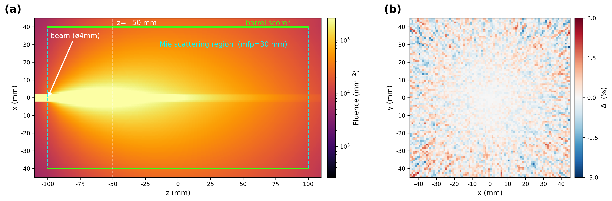

# 06 — Mie diffusion in a cylindrical fog

Verifies the GPU (Metal) vs Geant4 CPU fluence accuracy in a **multi-bounce diffusion**
environment where an opticalphoton beam passing through a cylindrical fog spreads out via
**Mie scattering (HG forward g=0.8)**.
With weak fog (mfp=30 mm, transport ℓ\*=150 mm, tube length 200 mm = 1.33 ℓ\*), this is a setup
where the **beam trajectory remains clearly visible**.



## Setup

### Geometry

| volume | type | dimensions | material | note |
|---|---|---|---|---|
| World | TsBox | HLX/HLY=20 cm, HLZ=30 cm | Air | n=1, AbsLength=1e6 cm |
| InnerMieCyl | TsCylinder | RMax=4 cm, HL=10 cm | MieMat | fog body |
| BarrelShell | TsCylinder | RMin=4 cm, RMax=4.1 cm, HL=10 cm | Air | barrel scorer substrate |

**Mie matter (MieMat, fog)**: Hydrogen 1.0, ρ=0.001 g/cm³, n=1.0, AbsLength=1e6 cm,
MIEHG mfp = **30 mm**, MIEHG_FORWARD g=0.8 / BACKWARD=0.0 / FORWARD_RATIO=1.0.

### Source / Beam

- Particle/energy: opticalphoton, 2.5 eV.
- Position/direction: (0, 0, −150 mm) → +z (OptSrcGroup TransZ=−15 cm).
- Cross-section: pencil, ø4 mm (rectangular cutoff X/Y=2.0 mm).
- Photon count: **1B** (barrel·x-z·x-y·CPU all identical).
- Generation path: GPU uses the **BEAM kernel** (`BeamPhotons=1e9`, single trigger event, EventBatchSize=5M),
  CPU uses **TOPAS Beam** (`NumberOfHistoriesInRun=1e9`, Flat distribution).

### Scorer

| scorer | component | binning (R·φ·z or X·Y·Z) | parallel | GPU quantity | CPU quantity |
|---|---|---|---|---|---|
| Barrel (φ-z) | BarrelShell | 1 × 180 × 200 | no | GPUOpticalPhotonFluence | Fluence |
| XZ (beam trajectory) | ScoreXZ (TsBox, HLX/Y=45, HLZ=110 mm) | 120 × 1 × 300 (y integrated) | yes | GPUOpticalPhotonFluence | — (GPU only) |
| XY (z=−50 mm cross-section) | ScoreXY (TsBox, HLX/Y=45, HLZ=1 mm, TransZ=−50 mm) | 90 × 90 × 1 | yes | GPUOpticalPhotonFluence | Fluence |

The GPU scores all three scorers simultaneously in **one run** (`spread_m30_both_gpu.txt`). The CPU reference
(`spread_m30_cpu.txt`) scores only the barrel φ-z and z=−50 mm x-y scorers (the x-z beam trajectory is GPU-only).

## Running

```bash
cd benchmark/06_mie_diffusion_cyl
./run_gpu.sh                 # GPU barrel+x-z+x-y simultaneous (one run, 1B); figure auto if CPU cache exists
./run_cpu.sh                 # CPU barrel+x-y reference (g4optical 1B) — default 20 threads
THREADS=30 ./run_cpu.sh      # adjust CPU thread count
python3 plot.py              # → results/fig_06_mie.{png,pdf} (manual regeneration)
```

| script | output | method |
|---|---|---|
| `run_gpu.sh` | `spread_m30_barrel_GPU.csv`, `spread_m30_xz_GPU.csv`, `spread_m30_xy50_GPU.csv` | GPU BEAM kernel, `spread_m30_both_gpu.txt` one run (multi-scorer) |
| `run_cpu.sh` | `spread_m30_barrel_CPU.csv`, `spread_m30_xy50_CPU.csv` | CPU g4optical, `spread_m30_cpu.txt` |
| `plot.py` | `results/fig_06_mie.{png,pdf}` | (a) x-z beam trajectory + (b) z=−50 mm GPU−CPU difference map |

`run_gpu.sh` runs `plot.py` automatically once the CPU cache (`spread_m30_barrel_CPU.csv`) exists; otherwise run `python3 plot.py` manually after both engines have run.

### Environment variables

| variable | default | scope | description |
|---|---|---|---|
| `THREADS` | 20 | run_cpu.sh | CPU g4optical thread count. The GPU uses the BEAM kernel (single trigger event), so it is irrelevant |
| `TOPAS` | patched `topas-gpu` | all runs | binary path override (`../common/topas_env.sh`). Must be the patched binary |
| `G4TRACE_DIR` | OFF | all runs | forces `G4TRACE_DIR=OFF` on all runs |

## Notes — benchmark-specific mechanism

**transport length ℓ\***: mfp (mean free path) = the average distance a photon travels before
undergoing one scattering event (here 30 mm). However, forward-peaked scattering (g=0.8) barely changes
the direction of travel in a single scattering event, so the scale that actually governs the diffusion is the
**transport length** ℓ\* = mfp/(1−g) = 30/(1−0.8) = **150 mm**.
The tube length 200 mm = 1.33 ℓ\*, which is **just before** the photons become fully isotropically diffused,
so the beam trajectory remains clearly visible in figure (a).

**multi-scorer**: The GPU scores **3** optical scorers (barrel φ-z + x-z + z=−50 x-y) simultaneously in
**one GPU run**. The 1B beam is propagated **only once** and its transit hits are scored by each of the three
scorers separately, so the barrel is bit-identical to a standalone run, and the x-z·x-y scorers share the same
beam (no re-propagation per scorer).
Implementation: `../../topas_extension/TsScoreGPUOpticalPhotonFluence.cc`.

**Figure panels**:
- (a) beam + Mie-scattered fluence **x-z cross-section** (GPU). Fog region (cyan dashed box) + barrel scorer location (green) + z=−50 mm marker.
- (b) **GPU−CPU relative difference map** (±3 %) of the z=−50 mm transverse cross-section (x-y).

## File structure

```
06_mie_diffusion_cyl/
├── run_gpu.sh                          # GPU barrel+x-z+x-y simultaneous (BEAM kernel, one run)
├── run_cpu.sh                          # CPU barrel+x-y reference (g4optical, THREADS adjustable)
├── plot.py                             # (a) x-z beam trajectory + (b) z=−50 mm GPU−CPU difference map
├── configs/
│   ├── spread_m30_both_gpu.txt         # GPU: barrel φ-z + x-z box + z=−50 x-y (multi-scorer)
│   └── spread_m30_cpu.txt              # CPU: barrel φ-z + z=−50 x-y (g4optical)
└── results/                            # CSV is gitignored (regenerated by scripts)
    ├── spread_m30_barrel_{CPU,GPU}.csv # barrel φ-z fluence
    ├── spread_m30_xz_GPU.csv           # x-z beam trajectory (GPU only)
    ├── spread_m30_xy50_{CPU,GPU}.csv   # z=−50 mm transverse cross-section fluence
    ├── spread_m30_{both_gpu,cpu}.log   # run logs
    └── fig_06_mie.{png,pdf}            # final figure (a) x-z + (b) difference map
```

Master index: [`../README.md`](../README.md)
