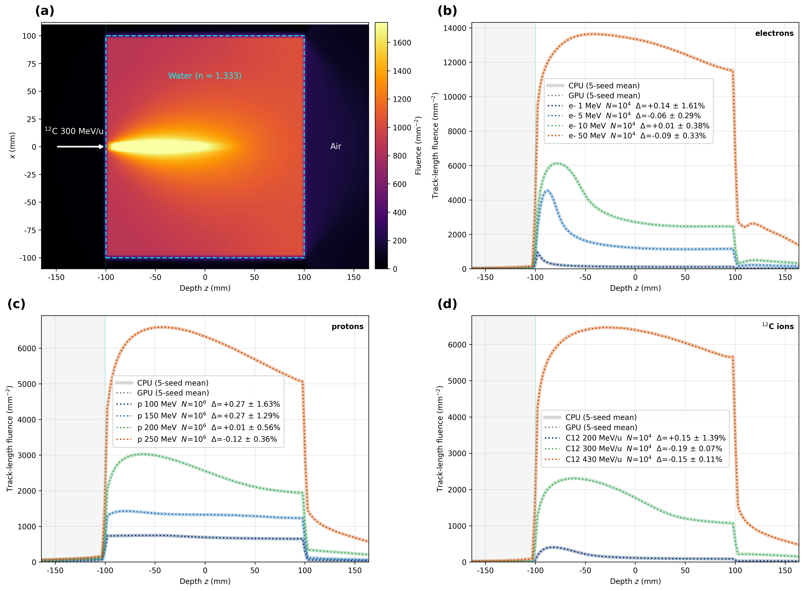

# 07 — Cherenkov in Water

Compares the on-axis depth (z) fluence profile of Cherenkov emission produced as a charged particle traverses water (n = 1.333), between the GPU (Metal) optical engine and the Geant4 CPU. It is an air-gap setup in which the beam is injected 5 cm outside the water so that photons beyond the critical angle (48.6°) are trapped by TIR at the water–air boundary, covering 11 cases of e⁻ / proton / ¹²C.



## Results

Full-grid voxel-sum deviation Δ = 100·(GPU/CPU − 1), seed mean ± SD (canonical
4.2.3 / Geant4 11.3.2 results; protons: fresh 1e6 × 10 seeds, 2026-07-03;
electrons / ¹²C: 5 seeds):

| case | Δ (mean ± SD) | case | Δ (mean ± SD) |
|---|---|---|---|
| e⁻ 1 MeV | +0.14 ± 1.61 % | p 100 MeV | **+0.27 ± 1.63 %** |
| e⁻ 5 MeV | −0.06 ± 0.29 % | p 150 MeV | **+0.27 ± 1.29 %** |
| e⁻ 10 MeV | +0.01 ± 0.38 % | p 200 MeV | +0.01 ± 0.56 % |
| e⁻ 50 MeV | −0.09 ± 0.33 % | p 250 MeV | −0.12 ± 0.36 % |
| ¹²C 200 MeV/u | +0.15 ± 1.39 % | ¹²C 300 MeV/u | −0.19 ± 0.07 % |
| ¹²C 430 MeV/u | −0.15 ± 0.11 % | **overall (11-case mean)** | **+0.02 %** |

Every case mean is within the 1 % target; the largest means are the near-threshold 100/150 MeV
protons at +0.27 %, whose seed-to-seed SD (up to 1.6 %) reflects the counting statistics of the
low-yield nuclear-secondary Cherenkov signal.

## Setup

### Geometry

| volume | type | dimensions (half-length) | material |
|---|---|---|---|
| World | TsBox | 110 × 110 × 165 mm | Air (n = 1, no absorption) |
| WaterBox | TsBox | 100 × 100 × 100 mm (20 cm cube, z ∈ [−100, 100] mm) | Water (n = 1.333) |
| ScoreBox | TsBox (parallel) | 110 × 110 × 165 mm | — (scoring only) |

World = Air, with a single Water box at the center. The beam is injected toward +z **from z = −150 mm, which is 5 cm outside the water front face (z = −100 mm)** — the air-gap is needed so that Cherenkov photons beyond the critical angle get trapped by TIR at the water–air boundary.

### Source / Beam

`So/Beam` (TOPAS Beam source, cross-section None, energy spread 0). On the GPU as well, the charged-particle transport is done by Geant4 and only the photons are handed off to the GPU, so it uses the TOPAS Beam generation path rather than a dedicated BEAM kernel.

| case | particle (`BeamParticle`) | `BeamEnergy` | particle count (`NumberOfHistoriesInRun`) |
|---|---|---|---|
| `e1` `e5` `e10` `e50` | e⁻ | 1 / 5 / 10 / 50 MeV | 10 000 |
| `p100` `p150` `p200` `p250` | proton | 100 / 150 / 200 / 250 MeV | 1 000 000 |
| `c12_200` `c12_300` `c12_430` | `GenericIon(6,12)` | 2400 / 3600 / 5160 MeV (= 200 / 300 / 430 MeV/u × 12) | 10 000 |

The case token matches the middle part of the config filename (`cherenkov_<case>_xz_{gpu,cpu}.txt`). Physics modules: e⁻ and ¹²C use `g4em-standard_opt4` + optical, while protons additionally include the hadronic `g4h-phy_QGSP_BIC` (GPU uses optical = `gpuoptical`, CPU uses `g4optical`).

### Scorer

The x–z 2D fluence of the parallel `ScoreBox` (`IsParallel = True`, registered in `LayeredMassGeometryWorlds`). It is a cross-section integrated over y.

| item | value |
|---|---|
| binning | XBins = 60, YBins = 1, ZBins = 130 |
| extent | x ∈ [−110, 110] mm, z ∈ [−165, 165] mm |
| GPU quantity | `GPUOpticalPhotonFluence` |
| CPU quantity | `Fluence` |
| filter | `opticalphoton` only |

**Water absorption (realistic pure-water approximation)** — strong IR/UV absorption, blue ~49 m transparent. The config `Ma/Water/AbsLength` is a table that fine-tabs 1.5–5.0 eV at 40 points (proper sampling of the steep absorption curve, avoiding spline overshoot); an excerpt:

| wavelength | absorption length | | wavelength | absorption length |
|---|---|---|---|---|
| 827 nm (IR) | 3 cm | | **422 nm (blue, most transparent)** | **49 m** |
| 667 nm (red) | 0.8 m | | 366 nm (violet) | 26 m |
| 559 nm (green) | 7.9 m | | 309 nm (UV) | 9.7 m |
| 499 nm (cyan) | 25 m | | 248 nm (UV) | 1 m |

## Running

Runs the 11 cases automatically per device. The configs (`configs/cherenkov_*_xz_{gpu,cpu}.txt`) are committed, so no separate generation is needed.

| script | device | output | method |
|---|---|---|---|
| `run_gpu.sh` | GPU (Metal) | `results/<case>_xz_GPU.csv` | runs each case's config with patched topas-gpu |
| `run_cpu.sh` | CPU (Geant4) | `results/<case>_xz_CPU.csv` | same, only the optical module is `g4optical` |

```bash
cd benchmark/07_cherenkov_water
./run_gpu.sh                      # GPU, all 11 cases
./run_cpu.sh                      # CPU, all 11 cases
./run_gpu.sh "p100 p250"          # specific cases only (first argument)
CASES="e5 e10 e50" ./run_cpu.sh   # specify via env
python3 plot.py                   # panel (a) from the run outputs; panels (b)-(d) need the 5-seed multiseed CSVs (see Notes)
```

### Environment variables

| variable | default | scope | description |
|---|---|---|---|
| `CASES` (or first argument) | 11 cases `c12_200 c12_300 c12_430 e1 e5 e10 e50 p100 p150 p200 p250` | run_gpu/cpu | list of cases to run (space-separated). Priority **argument → env → default** |
| `THREADS` | fixed at `20` | run_gpu/cpu | fixed in the run script (env override disabled). Since even GPU mode does charged-particle transport on Geant4, T=1 serializes heavy cases (¹²C ions etc.) and is a loss |
| `TOPAS` | `topas-gpu` (`../common/topas_env.sh`) | both | TOPAS binary. **patched required** — unpatched overcounts optical fluence by 4× |

## Notes

- **No step cutoff**: photons terminate naturally by absorption (mean ~8 bounces). Light trapped in the air-gap also attenuates and dies via finite absorption, so the path sum converges → no cutoff needed. Both GPU `MaxStepsPerPhoton` and CPU `Ts/MaxStepNumber` are left unset (default).
- **G4TRACE_DIR=OFF**: the run script turns off g4trace disk logging. If left on, the CPU becomes tens to hundreds of times slower (the result is bit-identical).
- **¹²C energy notation**: `BeamEnergy` is the total kinetic energy (MeV). It is written by multiplying by the nucleon number (12), e.g. 200 MeV/u → 12 × 200 = 2400 MeV.
- **on-axis profile**: plot.py draws the z-profile averaged only over the |x| < 5 mm cone center of the x–z map (not the full integral). The Δ in the legend is the full-grid voxel-sum deviation 100·(GPU/CPU − 1), mean ± SD, from the canonical results (`CANONICAL_DELTA` in plot.py): electrons / ¹²C from the 5-seed multiseed set (seeds 11/22/33/44/55), protons from the fresh 1e6 × 10-seed rerun — the multiseed CSVs are not shipped (gitignored); all legend Δ values are quoted from `CANONICAL_DELTA` rather than recomputed locally.

## File structure

```
07_cherenkov_water/
├── README.md
├── run_gpu.sh                          # GPU runner (11 cases automatic, THREADS=20 fixed)
├── run_cpu.sh                          # CPU runner (same, g4optical)
├── plot.py                             # 2×2 panel (geometry sketch + e-/proton/C12 z-fluence)
├── configs/
│   ├── cherenkov_<case>_xz_gpu.txt     # GPU config (gpuoptical, GPUOpticalPhotonFluence)
│   └── cherenkov_<case>_xz_cpu.txt     # CPU config (g4optical, Fluence)
│                                       #   <case> = e1 e5 e10 e50 / p100 p150 p200 p250 / c12_200 c12_300 c12_430
└── results/
    ├── <case>_xz_{GPU,CPU}.csv         # x-z 2D fluence (60×130, regenerated by the script)
    ├── multiseed/<case>_{GPU,CPU}_s{11,22,33,44,55}.csv  # 5-seed (for Δ statistics)
    └── fig_07_cherenkov_geometry_and_zfluence_cpu_gpu.png  # final figure
```

`results/run_<case>_{gpu,cpu}.log` (run logs) are gitignore (`*.log`) targets and are not tracked. The `<case>_xz_*.csv` are gitignored (regenerable with the run scripts). The `multiseed/` CSVs are gitignored too but are **not** produced by the run scripts — regenerating them requires manually setting `i:Ts/Seed` (11/22/33/44/55) and moving the outputs into `results/multiseed/`. A clone ships only the final figure.

Master index: [`../README.md`](../README.md)
