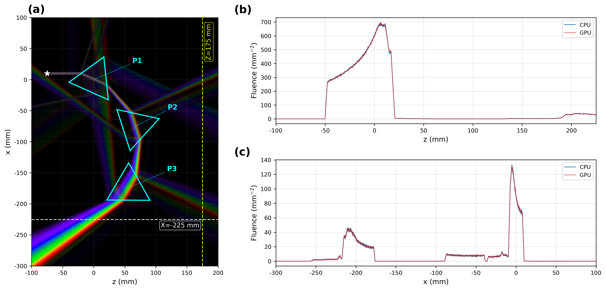

# 08_dispersion_prism

Validates the **wavelength dispersion** n(λ) of a triangular prism (SF1 flint glass, `G4SPolyhedra` N=3)
by comparing the GPU (Metal) optical engine against Geant4 CPU. A visible-light (1.65–3.10 eV continuous spectrum)
opticalphoton beam passes through a cascade of 3 prisms and is refracted at different angles per wavelength
(rainbow spectral splitting).



## Setup

### Geometry

| volume | type | dimensions | material | note |
|---|---|---|---|---|
| `World` | `TsBox` | HL 1500×100×1500 mm | `Air2` | n=1.0 (no dispersion) |
| `Prism` | `G4SPolyhedra` N=3 | R=40 mm, Z −25..25 mm | `SF1` | 60° apex, RotX=90°→apex axis=Y, PhiStart 96°, TransX 0 mm |
| `Prism2` | `G4SPolyhedra` N=3 | R=40 mm, Z −25..25 mm | `SF1` | PhiStart 47.8°, TransX −75 mm, TransZ 67 mm |
| `Prism3` | `G4SPolyhedra` N=3 | R=40 mm, Z −25..25 mm | `SF1` | PhiStart 359.6°, TransX −174 mm, TransZ 56 mm |
| `ScorePlane` | `TsBox` (parallel) | HLX 200, HLY 100 mm; HLZ 175 (profile) / 1000 (xze) mm | — | `IsParallel=True`, `LayeredMassGeometryWorlds`, TransX −100 mm; TransZ 50 (profile) / 0 (xze) mm |

The 3 prisms are arranged in a cascade to accumulate the spectral splitting (SF1 Δn≈0.13 over the tabulated 1.5–5.0 eV, about 1.9× BK7's 0.068 → 3-prism ~23° angular dispersion).
`ScorePlane` is registered as a parallel world separate from the mass world (`IsParallel=True`, `LayeredMassGeometryWorlds`).

### Materials

Defined in `configs/dispersion_base.txt`. The prism material is **SF1**; `BK7` is only defined for reference/comparison.

| material | RIndex | AbsLength | note |
|---|---|---|---|
| `SF1` | 11 points 1.5–5.0 eV, n=1.600–1.730 | 1e6 cm (effectively non-absorbing) | prism material |
| `BK7` | 11 points 1.5–5.0 eV, n=1.510–1.578 | 1e6 cm | defined only (unused in current config) |
| `Air2` | 2 points, n=1.0 | 1e6 cm | World |

### Source / Beam

- `opticalphoton`, **continuous spectrum 1.65–3.10 eV** (visible light), position (x,y,z)=(10, 0, −75) mm, direction +z.
- Beam cross-section: rectangle, `BeamPosCutoffX=1.0 mm`, `BeamPosCutoffY=0.001 mm` (thin sheet).
- Default photon count **5M** (`PHOTONS`).
- **CPU**: TOPAS Beam source (`g4optical`, `So/Beam` continuous spectrum, thread=20).
- **GPU**: **BEAM kernel** (`gpuoptical`, 5M photons generated directly kernel-side, triggered by a single host G4 event). Position, direction, and spectrum are passed directly to the GPU via the `Ph/Default/GPUOptical/Beam*` parameters.

### Scorer

| scorer | quantity (CPU / GPU) | binning | config | measures |
|---|---|---|---|---|
| `Prof` | `Fluence` / `GPUOpticalPhotonFluence` | XBins 3200 × YBins 1 × ZBins 2800 (0.125 mm voxel) | `dispersion_profile_{cpu,gpu_bk}.txt` | z/x fluence profile after the prisms (GPU vs CPU) |
| `XZE` | `GPUOpticalPhotonFluence` (GPU only) | XBins 200 × YBins 1 × ZBins 1000 × EBins 50 (1.65–3.10 eV) | `dispersion_visible_xze_gpu_bk.txt` | spectrally split rainbow 2D fluence (figure panel a) |

The profile config shrinks `ScorePlane` to HLZ=175 mm·TransZ=50 mm to match the 0.125 mm binning to the plot extent.
`xze` is a GPU-only test for rendering the rainbow map, so CPU is not run.

## Running

| script | device | tests (default) | products | method |
|---|---|---|---|---|
| `run_gpu.sh` | GPU (Metal) | `profile xze` | `results/disp_prof_GPU_bk.csv`, `results/disp_xze_GPU.csv` | BEAM kernel (kernel-side generation) |
| `run_cpu.sh` | CPU (Geant4) | `profile` | `results/disp_prof_CPU.csv` | TOPAS Beam source |
| `plot.py` | — | — | `results/fig_08_combined_cpu_vs_gpu.{png,pdf}` | generate figure after both gpu+cpu have run |

```bash
cd benchmark/08_dispersion_prism
./run_gpu.sh                      # GPU: profile + xze
./run_cpu.sh                      # CPU: profile (xze is GPU only)
./run_gpu.sh "xze"                # only a specific test (first argument)
TESTS="profile" ./run_gpu.sh      # specify via env
python3 plot.py                   # generate figure after both gpu+cpu have run
```

### Environment variables

| variable | default | scope | description |
|---|---|---|---|
| `TESTS` | GPU `profile xze` / CPU `profile` | run_gpu.sh·run_cpu.sh | tests to run (first argument → env → default order). Same role as `SIZES` in 01, `ANGLES` in 02, `CASES` in 07 |
| `PHOTONS` | `5000000` (5M) | run_gpu.sh·run_cpu.sh | photon count. GPU→`u:Ph/Default/GPUOptical/BeamPhotons` (any N, e.g. `5000000`·`1.0e10`), CPU→`i:So/Beam/NumberOfHistoriesInRun` (integer·≤2.15B·slow) |
| `THREADS` | CPU `20` / GPU `1` | run_gpu.sh·run_cpu.sh | overrides `i:Ts/NumberOfThreads`. **CPU only effective** — GPU uses the BEAM kernel (kernel-side generation) so thread is irrelevant |
| `TOPAS` | `topas-gpu` (`../common/topas_env.sh`) | common/topas_env.sh | TOPAS binary (**patched required**; unpatched overestimates fluence by about 4×) |

```bash
PHOTONS=1.0e10 ./run_gpu.sh "xze"     # GPU 10B (BEAM kernel)
PHOTONS=5000000 ./run_cpu.sh          # CPU 5M (profile)
```

## Notes

- **Quantitative comparison requires the same `PHOTONS`**: to see G/C≈1 of the profile fluence, both GPU and CPU `PHOTONS` must be set to the same value (e.g. both 5M). If the counts differ, the profile fluence is off by the photon-count ratio.
- **GPU is deterministic**: the BEAM kernel triggers only a single host G4 event, so it is thread-independent and reproducible at thread=1. CPU uses multithreading via `THREADS` (default 20).
- **`G4TRACE_DIR=OFF`** is applied automatically in both scripts (g4trace disk logging off → normalizes speed, result is bit-identical).
- **Rainbow color rendering**: `plot.py` converts the 50 energy bins of `xze` to sRGB via the CIE 1931 color matching function (Wyman et al. 2013) and composites them with an intensity-weighted blend (not line raster, voxel fluence).

## File structure

```
08_dispersion_prism/
├── run_gpu.sh                              # GPU BEAM kernel runner (profile + xze)
├── run_cpu.sh                              # CPU (Geant4 g4optical) runner (profile)
├── plot.py                                 # combined figure: rainbow spectral splitting + z/x profile
├── configs/
│   ├── dispersion_base.txt                 # common: materials(SF1/BK7/Air2)·3-prism geometry·beam·scorer
│   ├── dispersion_profile_cpu.txt          # CPU profile (Fluence, g4optical)
│   ├── dispersion_profile_gpu_bk.txt       # GPU profile (GPUOpticalPhotonFluence, BEAM kernel)
│   └── dispersion_visible_xze_gpu_bk.txt   # GPU xze rainbow map (EBins 50, GPU only)
└── results/                                # CSV/log/PDF regenerated by the scripts (gitignored); only the final PNG is tracked
    ├── disp_prof_CPU.csv                    # CPU profile fluence (regenerated by script)
    ├── disp_prof_GPU_bk.csv                 # GPU profile fluence
    ├── disp_xze_GPU.csv                     # GPU x-z-energy rainbow fluence
    ├── run_profile_{gpu,cpu}.log, run_xze_gpu.log  # run logs (xze is GPU-only)
    └── fig_08_combined_cpu_vs_gpu.{png,pdf} # final combined figure
```

Master index: [`../README.md`](../README.md)
