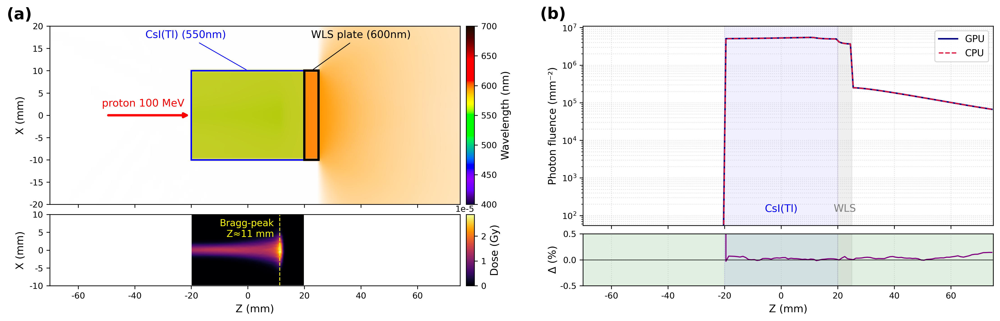

# 09_csi_wls_plate — CsI(Tl) scintillator + WLS plate

A proton beam stops at the Bragg peak inside a CsI(Tl) scintillator, isotropically producing 550nm
visible light. A **5-face reflector wrap on the CsI** traps the side photons and funnels them toward the
plate-facing direction (Z+), after which the WLS plate re-emits them at 600nm. The proton genstep →
scintillation/WLS photon propagation is compared between GPU (Metal) and Geant4 CPU
(DDA fluence scoring + DoseToMedium).



## Setup

### Geometry / materials

| Volume | Material | Size (full) | Position | Role |
|---|---|---|---|---|
| World | Air | 100×100×160 mm | origin | outer boundary |
| CsIbox | CsI(Tl), n=1.79 | 20×20×40 mm | origin | scintillator (550nm emission, ScintillationYield 100/MeV, Birks 0.0032, AbsLength 50cm) |
| RefXp/Xm/Yp/Ym/Zm | dielectric_metal (R=0.95) | thin slab 0.1mm | CsI X±/Y±/Z− faces | CsI **5-face** reflector wrap (the plate-facing Z+ face is open) |
| PlateRefXp/Xm/Yp/Ym | dielectric_metal (R=0.95) | thin slab 0.1mm | plate X±/Y± faces (z 20.1~25) | blocks plate back-side re-emission stray light |
| WLSplateGeo | WLSplate, n=1.5 | 20×20×5 mm | Z 20~25 | 550→600nm re-emission (WLSABSLENGTH 550nm absorption → WLSCOMPONENT 600nm isotropic re-emission, τ=5ns) |

- The CsI end face (Z+) has no reflector, so photons pass through to the plate → plate WLS operates.
- The reflector slab is a thin Air box that acts only as a surface (`OpticalBehavior = CsIreflector`, unified/polished).

### Beam

| Item | Value |
|---|---|
| Particle / energy | proton 100 MeV (energy spread 0) |
| Position | z = −50 mm, +Z direction |
| Cross section | Gaussian spot σ=1mm, ellipse cutoff 3mm |
| Photon count | proton 10000 (default) → scintillation photons generated via the genstep path (not the BEAM kernel) |

### Scorer

| scorer | quantity (GPU / CPU) | component | binning | output |
|---|---|---|---|---|
| PS (fluence) | `GPUOpticalPhotonFluence` / `Fluence` | ScoreBox (parallel, 80×80×145 mm) | XBins 80, ZBins 145, EBins 50 (1.5~3.5 eV) | `csi_wls_GPU.csv` / `csi_wls_CPU.csv` |
| Dose | `DoseToMedium` | CsIbox | XBins 50, ZBins 80 | `csi_wls_dose.csv` / `csi_wls_dose_cpu.csv` |

The GPU uses the `gpuoptical` module + a parallel-world fluence scorer; the CPU uses the `g4optical` module + the same binning `Fluence`.

## Running

| Script | device | module | output (results/) |
|---|---|---|---|
| `run_gpu.sh` | GPU (Metal) | gpuoptical | `csi_wls_GPU.csv` + `csi_wls_dose.csv` + `run_gpu.log` |
| `run_cpu.sh` | CPU (Geant4) | g4optical | `csi_wls_CPU.csv` + `csi_wls_dose_cpu.csv` + `run_cpu.log` |

```bash
cd benchmark/09_csi_wls_plate
./run_gpu.sh                 # GPU (default 10000 proton, T=1)
./run_cpu.sh                 # CPU (g4optical, T=20) — ⚠ directly tracks scintillation photons, so ~56 min
python3 plot.py              # after running both gpu+cpu → results/csi_wls_dose.png

# manual one-shot
cd configs && topas-gpu csi_wls_gpu.txt
```

### Environment variables

| Variable | Default | Scope | Description |
|---|---|---|---|
| `PHOTONS` | 10000 | gpu/cpu | proton count (`NumberOfHistoriesInRun`). Since this is the genstep scintillation path, it is not the beam-kernel `BeamPhotons` — the photon count is controlled by the proton count |
| `THREADS` | GPU 1 / CPU 20 | gpu/cpu | `NumberOfThreads` |
| `TOPAS` | common/topas_env.sh | gpu/cpu | binary path override (patched `topas-gpu` required). Every run applies `G4TRACE_DIR=OFF` automatically |

## Notes — genstep path

Visible-light generation uses a **transport-based genstep path**, a **general-purpose** approach that is
independent of the particle, geometry, or energy deposition (no prior profile assumption such as a Bragg
curve):

1. **Geant4 transports the primary particle (proton)** → at each step, upon energy deposition it emits a
   `genstep` = (position, direction, stepLength, material, photon count).
2. **The GPU `generateScintillationPhotons`** receives the genstep, places positions along the step, and
   generates **isotropic (4π) 550nm photons** → propagated directly on the GPU (including reflector/WLS).

Cherenkov works the same way, also genstep-based (`generateCerenkovPhotons`); only the emission shape
differs — a **cone around the particle direction** (θc, cosθc=1/(nβ)). Both are driven by gensteps that
Geant4 actually produced, so they work for arbitrary particles/geometries.

> Note: `generateBeamPhotons` (the beam kernel) is exclusively for **directly defined optical sources**
> (laser/LED/isotropic point source) without transport. Reproducing a Bragg profile by hand-fitting it
> into a beam is circular and therefore unsuitable for scintillation production — this benchmark uses the
> genstep path above.

Composition of the figure produced by `plot.py` (`csi_wls_dose.png`):
- **(a) top**: 2D visible light (wavelength color) — CsI 550nm green + WLS plate 600nm orange + proton arrow.
- **(a) bottom**: proton Bragg peak dose 2D (DoseToMedium inside the CsI box).
- **(b)**: GPU vs CPU photon fluence z-profile (log) + (GPU−CPU)/CPU % difference panel; the total G/C ratio is printed to the console (stdout).

## File structure

```
09_csi_wls_plate/
├── README.md
├── plot.py                     # a/b figure (2D wavelength + Bragg + z-profile G/C)
├── run_gpu.sh                  # GPU (gpuoptical, T=1) — csi_wls_GPU.csv + csi_wls_dose.csv
├── run_cpu.sh                  # CPU (g4optical, T=20) — csi_wls_CPU.csv + csi_wls_dose_cpu.csv
├── configs/
│   ├── csi_wls_gpu.txt         # GPU (5-face reflector wrap + WLS plate, GPUOpticalPhotonFluence)
│   └── csi_wls_cpu.txt         # CPU (g4optical, Fluence) — for GPU/CPU validation
└── results/                    # CSV/log/PDF gitignored (regenerated by the scripts); only csi_wls_dose.png is tracked
    ├── csi_wls_GPU.csv         # GPU fluence (XBins×ZBins×EBins)
    ├── csi_wls_CPU.csv         # CPU fluence (G4OpWLS, for comparison)
    ├── csi_wls_dose.csv        # GPU proton dose
    ├── csi_wls_dose_cpu.csv    # CPU proton dose
    ├── csi_wls_dose.{png,pdf}  # final figure
    └── run_{gpu,cpu}.log       # run logs (for extracting Execution Real)
```

Master index: [`../README.md`](../README.md)
